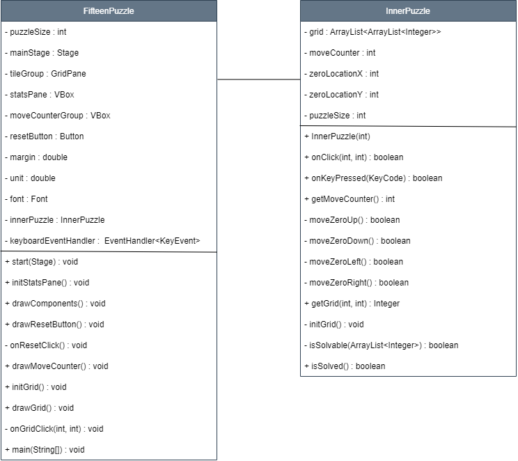

# 15 Puzzle

This repository is a final project (Java GUI) from Object-Oriented Programming Class, Teknik Informatika Universitas Padjadjaran. 

[Challenge Guidelines](challenge-guideline.md)

**Fifteen Puzzle merupakan sebuah permainan puzzle berukuran 4x4. Di dalamnya berisikan angka 1-15 yang disusun secara acak dan terdapat sebuah ubin kosong. Puzzle ini dapat diselesaikan dengan mengurutkan angka-angka acak tersebut dari angka 1 sampai 15 dengan ubin kosong berada di sebelah pojok kanan bawah.**

## Credits
| NPM           | Name        |
| ------------- |-------------|
| 140810200012  | Della Fauziyyah Husna |
| 140810200030  | Fauzan Azmi Dwicahyo |
| 140810200040  | Indah Sutriyati |

## Change log
- **[Sprint Planning](changelog/sprint-planning.md) - (23/11/2021)** 
   - Mencari referensi, diskusi awal, penyusunan backlog.

- **[Sprint 1](changelog/sprint-1.md) - (date from 17/11/2021 to 23/11/2021)** 
   - Implementasi Logika Puzzle 
   - Implementasi wireFrame UI dan merancang gambaran mockup 

- **[Sprint 2](changelog/sprint-2.md) - (date from 24/11/2021 to 30/11/2021)** 
   - Integrasi Logika Puzzle ke dalam UI
   - Sudah mengatur tampilan dari warna, font,letak
   - Membuat button reset
   - Membuat move counter
   - Membuat fitur biar bisa main pakai keyboard
   
- **[Sprint 3](changelog/sprint-3.md) - (date from 01/12/2021 to 07/12/2021)** 
   - Error handling 
   - Trial the app
   - Finishing

## Running The App

1. Compile dan jalankan project dengan menggunakan perintah :

 ```
 gradlew run (untuk ukuran default puzzle 4x4)
 ```
 
 ```
 gradlew run --args='n' (untuk ukuran puzzle nxn, dimana n adalah 2-8)
 ```
2. Tombol Keyword yang digunakan adalah sebagai berikut :
   Tombol `←`, `↓`, `→`, dan `↑` untuk menentukan arah pergerakan kotak kosong
3. Game ini pun bisa dimainkan hanya menggunakan mouse

## Classes Used

1. **Fifteen Puzzle** - `FifteenPuzzle.java`
   - Mengambil data dari Inner Puzzle untuk bisa ditampilkan
      
2. **Inner Puzzle** - `InnerPuzzle.java`
   - Berisi logika-logika yang digunakan dalam game fifteen puzzle
   



## Notable Assumption and Design App Details

- Rekomendasi ukuran game yaitu 2x2, 3x3, 4x4, 5x5, 6x6, 7x7, dan 8x8.
- Program kita _resizeable_. Namun, disarankan window nya berbentuk persegi panjang.
- Argumen int yang mungkin digunakan untuk menjalankan aplikasi adalah 2-8.
- Game FifteenPuzzle ini memiliki **Move Counter** untuk menghitung berapa langkah yang telah dilakukan oleh pemain dalam menyelesaikan game.
- Untuk memainkan game FifteenPuzzle ini, pemain dapat menggunakan mouse ataupun keyboard untuk memindahkan tile puzzle.
- Jika angka sudah tersusun dengan benar, maka kotak sudah tidak bisa dipindah yang menandakan game selesai atau menang.
- Terdapat tombol **Reset** yang dapat digunakan untuk mengacak ulang puzzle.
